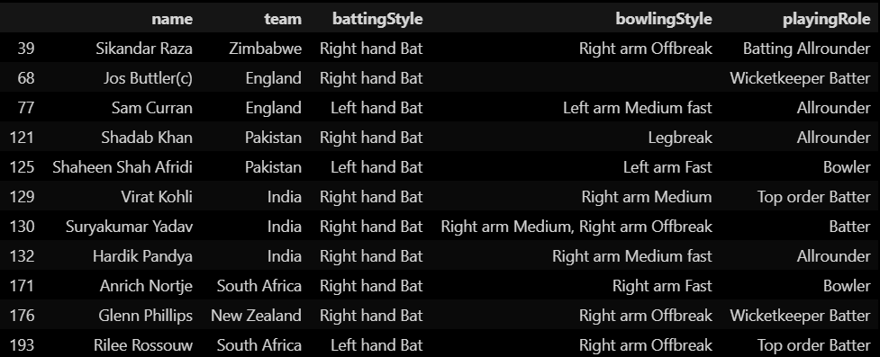

# Cricket Analysis with T20 World Cup Dataset

## Preview

    

## Project Description
Explore this data analysis project that delves into the T20 World Cup dataset. We've performed extensive data processing and analysis to identify the best 11 players in each category.

## Key Highlights
- Extracted and cleaned data from the T20 World Cup dataset.
- Utilized statistical analysis and machine learning techniques to evaluate player performance.
- Generated insights and recommendations for selecting the best 11 players from different categories.

## Technologies Used
- Python
- Pandas
- NumPy
